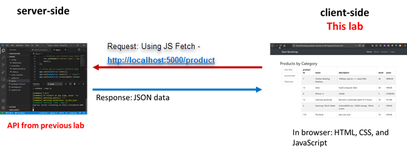

# Web API Client: Part 2 - Create, Update, and Delete Products

Enda Lee 2022

### Quick Start

1. Get the server API from https://github.com/elee-tudublin/2022_FT.SSWD_8.1_Web-API_Add_Product_Complete
2. Make sure the `Server API` app is running on http://localhost:5001
3. Download the start site from this repository.
4. Open in VS Code (separate to the server API instance).
5. In a terminal run `npm install`.
6. Start the application using `npm run dev`.


## Introduction

In this tutorial you will add new products the Database via an **`HTTP POST`** request to the API. The body of the POST request will include the values for a new product which need to be validated and inserted.


## 1. Pre-requisites

The application will use **separate** **`client`** and **`server`** applications which should be opened in separate VS Code instances when working on this lab.

##### Server-side

The client functionality is dependent on a server API with Category and Product endpoints. Make sure that the server API is running and listening on http://localhost:5001




The client site/ application will fetch its data from the server-side API running on http://localhost:5001


##### Client-side

Download the start application from this repository. During this lab you will add features to complete it.

## 2. The start site

#### 2.1. The main products page

When http://localhost:5173 loads first, the empty default page looks like the following. Note the completed column sort functionality and also the buttons. Not all of these functions are fully implemented in the start app.


#### 2.2  Column filtering

This feature is implemented in the start site. When a column header in the table is clicked, the table is sorted by that column - either in ascending or descending order.


Open `scr/routes/+page.svelte` to see the `on:click` handlers of each table header. Note that the call to `sortNumeric()` or `sortAlpha()` depending on the data type to be sorted. 


further up in  `scr/routes/+page.svelte` you can see the object used to keep track of sort direction and also the functions.


## 3. Adding a new Product via a form

#### 3.1. Show the form when the Add Product button is clicked

The button will be displayed under the products list:


```html
<a id="AddProductButton" class="btn btn-primary" href="/addproduct" role="button">New Product</a>
```

Note the link to `/addproduct`


#### 3.2  The form page and route

You can see that the button links to `/addproduct`. Add this route to the `routes` folder:

1. Add a new subfolder named after the route `addproduct`.
2. Add the svelte client page `+page.svelte`
3. Add a svelte server script `+page.server.js`   


##### The form (`+page.svelte`)

This is a **Bootstrap 5** styled form, which will look like this when displayed:


The following is the completed page which includes a `<script>` block the import all data required. 

The HTML part uses a Svelte `{#if }{:else}{/if}` block to display either:

-  either the form to add a product (this always happens on first load).
-  A success message after the product has bee successfully submitted and added to the database.
- Show the form again (for re-submission if something goes wrong (along with a message at the end of the form). 


```html
<script>

	// import required Sveltekit form features
	import { enhance, applyAction } from '$app/forms';

	// Import the store etc.
	import { categories, getAllCategories } from '../../stores/productStore.js';
	export let data;
	export let form;

	// Refresh the store when page loads (optional due to overhead but probably a good idea)
	export const load = async ({ fetch }) => {
		// Update list of categories (used in form)
		await getAllCategories();
		return {
		}
	}
</script>

<!-- Main Content - Products etc. -->
<div class="container">
	<!-- If the insert was sucessfull display the new product details-->
	<!-- the form data is returned by the server script for this page-->
	{#if form?.success}

		<div class="row">
			<!-- Page Header -->
			<!-- show form message if it exists-->
			<h2 class="mt-5">{form?.message || ''}</h2>
		</div>

		<div class="row">
			<div class="row mb-3">
				<h6>Product ID: {form?.product.id || ''}</h6>
			</div>
			<div class="row mb-3">
				<h6>Category: {form?.product.category_id || ''}</h6>
			</div>
			<div class="row mb-3">
				<h6>Name: {form?.product.product_name || ''}</h6>
			</div>
			<div class="row mb-3">
				<h6>Description: {form?.product.product_description || ''}</h6>
			</div>
			<div class="row mb-3">
				<h6>Stock: {form?.product.product_stock || ''}</h6>
			</div>
			<div class="row mb-3">
				<h6>Price: {form?.product.product_price || ''}</h6>
			</div>
		</div>
	<!-- else show the form again (very simple error handling - should also show validation errors)-->
	{:else}
		<div class="row">
			<!-- Page Header -->
			<h2 class="mt-5">Add Product</h2>
		</div>

		<div class="row">
			<!-- Product Form -->
			<form
			 	method="POST" 
			 	action="?/addproduct"
				 use:enhance={({ form }) => {
					// Before form submission to server
					return async ({ result, update }) => {
						// After form submission to server
						if (result.type === 'success') {
							await applyAction(result);
						}
						if (result.type === 'invalid') {
							await applyAction(result);
						}
						update();
					};
				}}
			 >
				<div class="row mb-3">
					<label for="category_id" class="form-label">Category:</label>
					<div class="col-sm-8">
						<select id="category_id" class="form-select" name="category_id">
							<option value="0">Choose a category</option>
                            <!-- Add each category as an option in the seclect -->
							{#each $categories as cat}
								<option value={cat.id}>{cat.category_name}</option>
							{/each}
						</select>
					</div>
				</div>
				<div class="row mb-3">
					<label for="product_name" class="form-label">Name:</label>
					<div class="col-sm-8">
						<input 
							id="product_name" 
							type="text" 
							class="form-control" 
							name="product_name" 
							value="{form?.product.product_name || ''}"
						/>
					</div>
				</div>
				<div class="row mb-3">
					<label for="product_description" class="form-label">Description:</label>
					<div class="col-sm-8">
						<input
						id="product_description"
						type="text"
						class="form-control"
						name="product_description"
						value="{form?.product.product_description || ''}"
					/>
					</div>
				</div>
				<div class="row mb-3">
					<label for="product_stock" class="form-label">Stock:</label>
					<div class="col-sm-8">
						<input 
							id="product_stock" 
							type="number" 
							class="form-control" 
							name="product_stock" 
							value="{form?.product.product_stock || ''}" 
						/>
					</div>
				</div>
				<div class="row mb-3">
					<label for="product_price" class="form-label">Price:</label>
					<div class="col-sm-8">
						<input
							id="product_price"
							type="number"
							min="0.00"
							max="10000.00"
							step="0.01"
							class="form-control"
							name="product_price"
							value="{form?.product.product_price || ''}"
						/>
					</div>
				</div>
				<!-- productId is a hidden field value is not required but set = 0-->
				<input id="id" type="hidden" value="0" />
				<div class="mb-3">
					<button type="submit" class="btn btn-primary"> Add Product </button>
					<a href="/" class="btn btn-secondary"> Cancel </a>
				</div>

				{#if form?.error}
					<div class="alert alert-danger col-sm-8" role="alert">validation failed: {form?.message}</div>
				{/if}
			</form>
			<!-- End form-->
		</div>
	{/if} <!-- End the if block-->
</div>

```


## 4. Saving a new product

The Add Product form has two attributes which define what happens after the **Add Product ** button is clicked.

1. **`method="POST"`** will result in a `POST` request to the server with the form data contained in the body of the request.
2. **`action="?/addproduct"`** defines the form `action` - the script/ function which will handle the data sent.


#### 3.1 The `addproduct` `action handler` 

This is defined in the server-side script`addproduct/+page.server.js`

Read the comments for details

```javascript
// Import sveltekit dependencies
import { invalid, redirect } from "@sveltejs/kit"

// Import the addNewProduct() function from the product store.
import { addNewProduct } from '../../stores/productStore.js';

// The form action handler(s)
export const actions = {

    // action function for adding a product - called when form is submitted
    // This is where the form sends its data
    addproduct: async ({request }) => {
      let success = false;

      // get data from the POST request
      const form_data = await request.formData();

      // read each value from the submitted form
      const product = {
        category_id: Number(form_data.get('category_id')),
        product_name: form_data.get('product_name'),
        product_description: form_data.get('product_description'),
        product_stock: Number(form_data.get('product_stock')),
        product_price: Number(form_data.get('product_price'))
      }

      // Basic validation
      if (product.category_id > 0 &&
          product.product_name != '' &&
          product.product_description != '' &&
          product.product_stock > 0 &&
          product.product_price > 0
      ) {
          // Add the new product via the API (using the product store function)
          const result = await addNewProduct(JSON.stringify(product));
          console.log('add product result: ', result)

        // return the result
        // This will display the success section of the page to show the newly added product
        return { 
          success: true,
          message: `New product added with id: ${result.product.id}`,
          product: result.product
        };

        // This will cause the form to redisplay for corrections, along with an error message
      } else {
        return invalid(400, {
          error: true,
          message: 'validation failed',
          product: product
        })
      }
    }

  };

```


The `addNewProduct()` function from `src/stores/productStore.js`

```javascript
// Add a new product by sending a POST request to the API
export const addNewProduct= async (product = '') => {

    if (product) {
        // build the request using the intRequest function
        const request = initRequest('POST', product);

        // Make th request via getAPIData() function
        const result = await getAPIData('/product', request);

        // refresh the store
        getAllProducts();

        // return the API result
        return result;

      // In case of error  
    } else {
        console.log('Store: Add new product failed: missing product');
    }
}

```


The `initRequest()` function from `src/stores/productStore.js` used to build the request - setting the method (POST) and also adding product data to the request body. Note that this is included in the fetch call made in `getApiData()`.

```javascript
//
// Used to Initialise  requests
// parameters: http method and body content note default values)
const initRequest = (http_method = 'GET', body_data = '') => {

    let request = {
        method: http_method,
        //credentials: 'include',
        headers: {
            "Accept": "application/json",
            "Content-Type": "application/json"
            //,"Authorization": "Bearer " + getAccessToken()
        },
        mode: 'cors',
        cache: 'default',
    };

    if (body_data) {
        request.body = body_data;
    }

    return request;
};
```


After a product has bee added successfully, a message is displayed showing the new product.


## 5. Exercises

### 5.1 Delete a product by id

The products table includes edit and **delete** icons for each product in the table. When clicked, a confirmation dialog is displayed asking for confirmation of the delete, along with the product id.


The functionality to delete via an API call is missing and currently clicking ok will only log a message to the console.


The `deleteProduct()` function can be found in `src/routes/+page.svelte`


**Complete the function so that it deletes the product by id using the `product store` and and an API call.**


### 5.2 Update an existing product

Clicking the pencil (edit) icon for a product will navigate to the `/editproduct/[id]` route:


This will display a message confirming the `id` param from the URL: 


The param is defined by creating a subfolder named `[id]` in the `updateproduct` route folder. 


`updateproduct/[id]/+page.svelte` contains the code to read the `id` parameter value from the `URL` and display it:

```html
<script>
    import { page } from '$app/stores';

</script>
  
  <h1>Params</h1>
  {#if ($page.params.id)}
    <h3>To Do: Update Product with id: {$page.params.id}</h3>
  {/if}
```

**To Do:** Add a form so that the product matching this id can be updated and submitted (similar to adding a new product).

Form actions, etc. should be defined in `updateproduct/[id]/+page.server.js`


##### 5.2.1. Also try http://localhost:5173/updateproduct?id=88888

If you need to send a parameter via the URL query string, you will find an example in `updateproduct/+page.svelte` and `updateproduct/page.js` 


------

Enda Lee 2022
